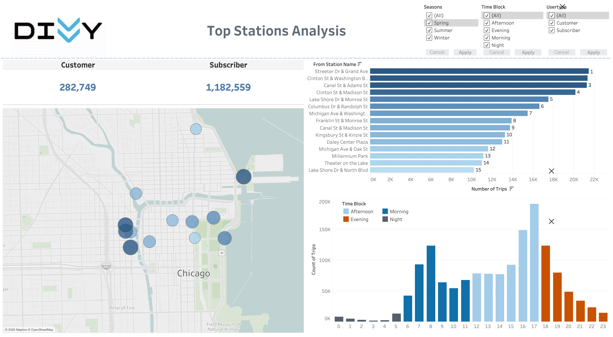

# Chicago-Divvy-Bicycle-Sharing-Data

## Overview: 
The goal of this project is to use Tableau to visualize the top station usage patterns of Divvy bikes in Chicago. By analyzing the trip data provided, we can gain insights into when, where, and how bikes are being used. This information can be useful for Divvy and the City of Chicago in planning future bike infrastructure and promoting sustainable transportation options.

## Data Source: 
* Stations: id, latitude, longitude, name, docks 
* Trips: rider age, rider birthyear, rider gender, bike id, usertype,  
&nbsp;&nbsp; trip id, start time, end time, from station, to station, trip duration

## Solution: 
[Link to interactive Tableau dashboard](https://public.tableau.com/views/Divvy_Top_Station_Analysis_17770713908670/TopStationsActivityDashboard?:language=en-US&:sid=&:redirect=auth&:display_count=n&:origin=viz_share_link)

